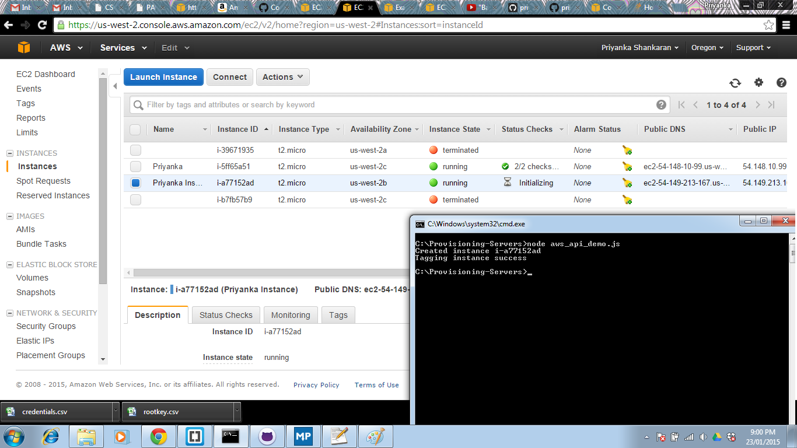

# Provisioning-Servers
-----------------------

i] **Amazon Elastic Compute Cloud:-**
-----------------------------

Amazon EC2 provides users the facility to use and obtain virtual instances of specific images, to deploy their own applications. EC2 provides such a web service, along with a very simple and user-friendly web interface in order to create virtual machines with given specifications such as an Amazon Machine Image, the Instance Type, Storage properties and so on. EC2 also allows you to pay only according to whatever you use.

ii] **Description of Authentication and API call:-**
--------------------------------------------

Initially, using the npm package manager for Node.js, we can install the AWS-SDK. The AWS package is then loaded in the code with the following code: 

var AWS = require('aws-sdk');

For authentication to AWS:

1] The access key and the secret authentication key were not hardcoded, but were set as environment variables using the commands set AWS_ACCESS_KEY_ID=xxxx and set AWS_SECRET_ACCESS_KEY=yyyyy. 

2] The region is also set either as an environment variable or as part of the code.

For the API call:

1] The API call uses JavaScript for language binding.

2] The main aim of the code is to create a new running instance, and then attaching a tag to an instance. 

3] For creating a new instance, 4 parameters of the instance are specified. The Image ID gives the ID for the image Amazon Linux AMI 2014.09.1 (HVM), which is an EBS backed image. The instance type for this image is the t2.micro.

4] The runInstances operation creates a new instance, and following the runInstances operation is the createTags operation, which adds a tag to a new instance.

5] The given code adds a 'Priyanka Instance' tag to the newly created instance, and this tag name can be changed by modifying the variable instanceName in the program.

6] On running this program in the terminal window, a new instance is created, with an instance ID and a tag, as can be seen in the figure.

References:
1] http://docs.aws.amazon.com/AWSJavaScriptSDK/guide/node-examples.html
2] http://docs.aws.amazon.com/cli/latest/userguide/cli-chap-getting-started.html#cli-environment